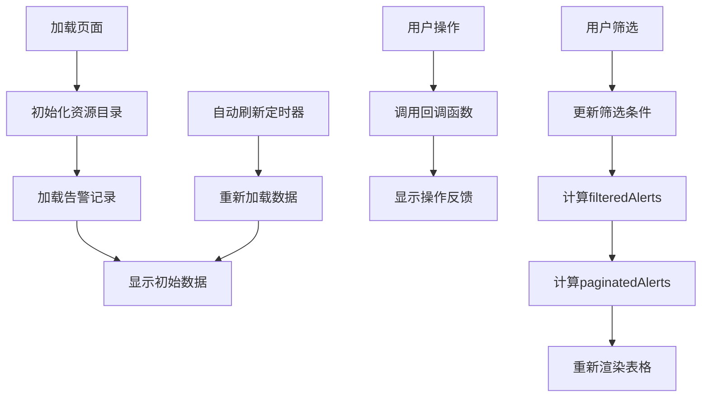

# 资产告警监测页面 - 设计思路文档

**页面路径**: `/management/alert-monitoring`
**功能模块**: 业务保障管理 → 资产告警监测
**创建日期**: 2025-10-14
**设计师**: Claude Code

---

## 一、功能概述

资产告警监测页面用于实时监控和管理业务系统的告警记录，支持多维度筛选、批量操作和自动刷新。用户可以根据资源类型、告警等级、处置状态等条件快速定位告警，并进行指派和关闭操作。

---

## 二、页面布局架构

### 2.1 整体布局

页面采用**三区块布局**设计：

```
┌─────────────────────────────────────────────────────────────┐
│  顶部栏 (Header)                                              │
│  - 面包屑导航                                                   │
│  - 时间范围选择器 + 自动刷新开关                                  │
└─────────────────────────────────────────────────────────────┘
┌──────────────┬──────────────────────────────────────────────┐
│              │  右侧内容区 (Content Right)                    │
│  左侧资源    │  ┌────────────────────────────────────────┐  │
│  目录树      │  │ 快速筛选卡片 (QuickFilter)                │  │
│  (Resource   │  │ - 告警等级筛选                             │  │
│   Tree)      │  │ - 处置状态筛选                             │  │
│              │  └────────────────────────────────────────┘  │
│  - 系统服务  │  ┌────────────────────────────────────────┐  │
│  - 基础软件  │  │ 告警列表卡片 (AlertTable)                 │  │
│  - 硬件设施  │  │ - 操作栏（批量指派/关闭 + 搜索）            │  │
│              │  │ - 数据表格                                 │  │
│              │  │ - 分页器                                   │  │
│              │  └────────────────────────────────────────┘  │
└──────────────┴──────────────────────────────────────────────┘
```

### 2.2 响应式适配

- **桌面端** (≥992px): 左右并排布局
- **平板端** (≥576px, <992px): 左右并排，减少间距
- **移动端** (<576px): 垂直堆叠布局

---

## 三、核心组件设计

### 3.1 ResourceTree 组件 (资源目录树)

**功能职责**:
- 展示监控对象的分类目录（系统服务、基础软件、硬件设施）
- 支持复选框选择，用于筛选告警数据
- "全部"选项与其他选项互斥

**交互逻辑**:
```typescript
点击资源项 → 切换复选框状态 → 触发onResourceChange回调 → 更新筛选条件
特殊规则:
- 选择"全部" → 取消其他选项
- 选择其他选项 → 取消"全部"
```

**UI规范**:
- 卡片宽度: 280px (固定)
- 分类标题: 14px, 600字重
- 资源项间距: 8px
- 悬停/选中状态: 使用 `--colorPrimary` 高亮

---

### 3.2 QuickFilter 组件 (快速筛选栏)

**功能职责**:
- 提供告警等级和处置状态的快速筛选
- 单选模式，点击即切换

**筛选选项**:

| 筛选维度 | 选项 | 标签颜色 |
|---------|------|---------|
| 告警等级 | 全部等级 / 紧急 / 严重 / 警告 | default / error / warning / gold |
| 处置状态 | 全部状态 / 待指派 / 待处理 / 处理中 / 待关闭 / 已关闭 | default / blue / default / purple / default / success |

**交互逻辑**:
```typescript
点击筛选标签 → 移除同组其他标签的active状态 → 添加当前标签active状态 → 触发回调 → 更新告警列表
```

---

### 3.3 AlertTable 组件 (告警列表)

**功能职责**:
- 展示告警记录表格（9列信息）
- 支持行选择和批量操作
- 支持分页和搜索

**表格列定义**:

| 列名 | 宽度 | 数据类型 | 渲染方式 |
|-----|------|---------|---------|
| 告警等级 | 100px | AlertLevel | Tag标签 |
| 告警名称 | 250px | string | 双行显示（名称+描述） |
| 告警发现时间 | 180px | string | 纯文本 |
| 告警ID | 180px | string | 纯文本 |
| 告警对象 | 150px | string | 纯文本 |
| 资源类型 | 120px | ResourceType | 中文映射 |
| 告警状态 | 100px | AlertStatus | Tag标签 |
| 处置责任人 | 120px | string | 纯文本（无则显示"-"） |
| 操作 | 160px | - | 按钮组（固定右侧） |

**批量操作逻辑**:
```typescript
选择行 → 更新selectedRowKeys → 启用批量按钮
点击批量指派/关闭 → 调用回调函数 → 显示成功消息 → 清空选择
```

**操作按钮条件渲染**:
- 已关闭告警: 仅显示"查看详情"按钮
- 未关闭告警: 显示"指派/重新指派" + "关闭"按钮

---

## 四、状态管理架构

### 4.1 组件状态树

```typescript
AlertMonitoring (主组件)
├── resourceCategories: ResourceCategory[]   // 资源目录数据
├── alertRecords: AlertRecord[]             // 告警记录原始数据
├── selectedLevel: AlertLevel | 'all'       // 选中的告警等级
├── selectedStatus: AlertStatus | 'all'     // 选中的处置状态
├── dateRange: [Dayjs, Dayjs]               // 时间范围
├── autoRefresh: boolean                    // 自动刷新开关
├── refreshInterval: number                 // 刷新间隔（秒）
├── loading: boolean                        // 加载状态
└── pagination: PaginationConfig            // 分页配置
```

### 4.2 数据流转流程



### 4.3 计算属性（useMemo）

```typescript
// 筛选后的告警（根据等级和状态）
const filteredAlerts = useMemo(() => {
  return alertRecords.filter(record => {
    if (selectedLevel !== 'all' && record.level !== selectedLevel) return false
    if (selectedStatus !== 'all' && record.status !== selectedStatus) return false
    return true
  })
}, [alertRecords, selectedLevel, selectedStatus])

// 分页后的告警（当前页数据）
const paginatedAlerts = useMemo(() => {
  const start = (pagination.current - 1) * pagination.pageSize
  const end = start + pagination.pageSize
  return filteredAlerts.slice(start, end)
}, [filteredAlerts, pagination.current, pagination.pageSize])
```

---

## 五、交互设计规范

### 5.1 顶部时间筛选

**组件**: DatePicker.RangePicker + Switch + Select

**交互逻辑**:
```
1. 选择时间范围 → 更新dateRange状态 → 重新加载数据
2. 切换自动刷新 → 启动/停止定时器
3. 更改刷新间隔 → 重启定时器（仅在开关打开时）
```

**刷新间隔选项**: 10秒 / 30秒 / 60秒

---

### 5.2 资源目录选择

**单选模式（每个分类内）**:
- 点击"全部" → 取消其他选项
- 点击其他选项 → 取消"全部"，可多选

**未来扩展**:
- 可根据选中的资源类型筛选告警数据（当前仅UI交互，未应用筛选逻辑）

---

### 5.3 快速筛选标签

**视觉反馈**:
- 默认状态: 灰色边框 + 默认文字颜色
- 选中状态: 彩色背景 + 白色文字 + 无边框
- 悬停状态: 鼠标指针变为手型

**筛选立即生效**: 点击后立即更新告警列表，无需提交按钮

---

### 5.4 告警列表操作

**批量操作**:
- 启用条件: 至少选择1行
- 操作后自动清空选择

**单行操作**:
- 指派: 打开指派对话框（未实现，显示消息提示）
- 关闭: 关闭告警（未实现，显示消息提示）
- 查看详情: 跳转到详情页（未实现）

**搜索功能**: 当前仅UI，未实现搜索逻辑

---

## 六、样式规范遵循

### 6.1 颜色系统

使用全局CSS变量，符合 `ant-design-b2b-uiux-spec.md` 规范：

```css
--colorPrimary: #1890FF      /* 主色 */
--colorText: #1F1F1F         /* 主文本 */
--colorTextSecondary: #595959 /* 次要文本 */
--colorBgContainer: #FFFFFF   /* 容器背景 */
--colorBgLayout: #F5F5F5      /* 页面背景 */
--colorSplit: #F0F0F0         /* 分割线 */
--shadow1: 0 2px 8px ...      /* 卡片阴影 */
```

### 6.2 间距系统（4px网格）

- 卡片间距: 24px
- 内部padding: 16px/24px
- 元素间隔: 8px/12px/16px

### 6.3 字体规范

- 标题: 16px, 600字重
- 正文: 14px, 400字重
- 辅助信息: 12px, 400字重
- 字体栈: `-apple-system, BlinkMacSystemFont, 'Segoe UI'...`

---

## 七、技术实现要点

### 7.1 类型安全

所有数据结构使用TypeScript接口定义：
- `AlertRecord`: 告警记录
- `ResourceCategory`: 资源类别
- `AlertLevel/AlertStatus/ResourceType`: 枚举类型
- `PaginationConfig`: 分页配置

### 7.2 性能优化

- 使用 `useMemo` 缓存计算结果
- 列表渲染使用 `key` 属性
- 避免不必要的组件重渲染

### 7.3 Mock数据

所有数据来自 `mock/alert-monitoring-data.ts`，包括：
- 7条示例告警记录
- 3个资源类别（14个资源项）
- 中文标签映射对象

---

## 八、测试验证清单

- [x] 页面正常加载，无编译错误
- [x] 资源目录复选框交互正常
- [x] 快速筛选标签切换正常
- [x] 告警列表数据正确显示
- [x] 分页器功能正常
- [x] 批量选择和操作按钮启用/禁用正常
- [x] 自动刷新功能正常
- [x] 响应式布局适配正常
- [ ] 搜索功能（待实现）
- [ ] 实际指派/关闭操作（待对接后端API）

---

## 九、未来优化方向

### 9.1 功能增强

1. **搜索功能实现**: 支持按告警名称、ID、对象等关键词搜索
2. **详情页开发**: 点击告警查看完整详情和处置记录
3. **指派对话框**: 实现责任人选择和备注填写
4. **资源筛选联动**: 根据资源目录选择筛选告警
5. **导出功能**: 支持导出筛选后的告警列表为Excel

### 9.2 性能优化

1. **虚拟滚动**: 处理大量数据时使用虚拟列表
2. **请求防抖**: 搜索输入添加防抖处理
3. **分页优化**: 后端分页替代前端分页

### 9.3 用户体验

1. **告警声音提示**: 新增紧急告警时播放提示音
2. **实时推送**: 使用WebSocket接收实时告警
3. **筛选条件保存**: 记住用户的筛选偏好
4. **快捷键支持**: 添加键盘快捷键操作

---

## 十、文件清单

### 10.1 组件文件

```
src/pages/management/alert-monitoring/
├── index.tsx                    # 主页面组件
├── index.css                    # 主页面样式
├── types.ts                     # TypeScript类型定义
└── components/
    ├── ResourceTree.tsx         # 资源目录树组件
    ├── ResourceTree.css         # 资源目录树样式
    ├── QuickFilter.tsx          # 快速筛选组件
    ├── QuickFilter.css          # 快速筛选样式
    ├── AlertTable.tsx           # 告警列表组件
    └── AlertTable.css           # 告警列表样式
```

### 10.2 Mock数据文件

```
src/mock/
└── alert-monitoring-data.ts     # 告警监测Mock数据
```

### 10.3 路由集成

在 `src/App.tsx` 中注册路由：
```typescript
<Route path="/management/alert-monitoring" element={<AlertMonitoring />} />
```

---

## 十一、设计原则总结

1. **组件化**: 按功能拆分为独立组件，便于维护和复用
2. **类型安全**: 全面使用TypeScript类型定义
3. **响应式**: 适配桌面、平板、移动端三种场景
4. **规范遵循**: 严格遵守Ant Design B2B UI/UX规范
5. **用户友好**: 清晰的视觉层次和即时反馈
6. **可扩展性**: 预留接口便于后续功能扩展

---

**版本历史**:
- v1.0 (2025-10-14): 初始版本，完成基础功能迁移
