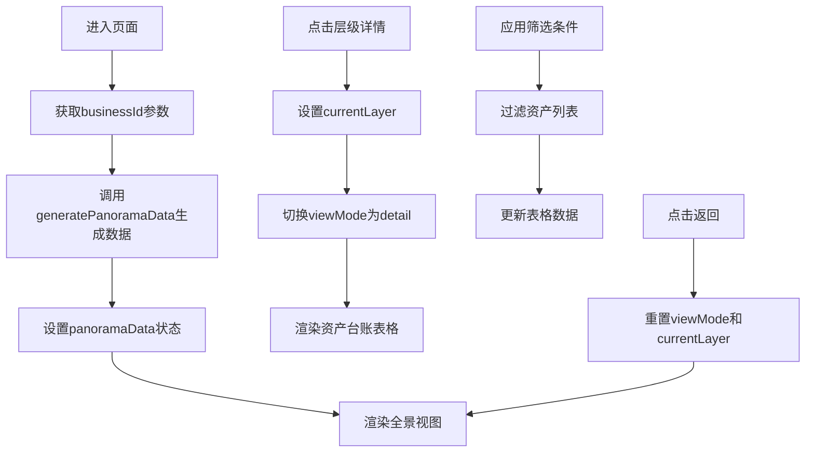

# 资产全景视图页面 - 设计思路文档

**页面路径**: `/management/asset-management/panorama/:businessId`
**功能模块**: 业务资产管理 → 资产全景视图
**创建日期**: 2025-10-15
**设计师**: Claude Code

---

## 一、功能概述

资产全景视图是资产管理功能的子页面，用于展示单个业务的四层资产架构（应用层、计算层、存储层、网络层）。提供全景视图和依赖分析两种展示模式，支持层级下钻查看资产台账详情。

---

## 二、页面布局架构

### 2.1 整体布局

```
┌─────────────────────────────────────────────────────────────┐
│  顶部栏 (Header)                                              │
│  - 面包屑导航                                                   │
│  - 全局搜索                                                     │
│  - 视图切换按钮组（全景/依赖分析）                                │
│  - 返回列表按钮                                                 │
└─────────────────────────────────────────────────────────────┘
┌─────────────────────────────────────────────────────────────┐
│  内容区 (Content)                                             │
│                                                               │
│  【资产全景模式】                                               │
│  ┌───────────────────────────────────────────────────────┐   │
│  │  业务基础信息面板                                        │   │
│  │  - 业务ID、状态、SLA等级、访问量、用户数                    │   │
│  │  - 责任主体卡片（责任主体/开发主体/运维主体）                │   │
│  └───────────────────────────────────────────────────────┘   │
│  ┌───────────────────────────────────────────────────────┐   │
│  │  应用层资产卡片                                          │   │
│  │  - 统计数据 + 蜂窝矩阵 + 图例                            │   │
│  │  - 详情链接 + 台账管理链接                                │   │
│  └───────────────────────────────────────────────────────┘   │
│  ┌───────────────────────────────────────────────────────┐   │
│  │  计算层资产卡片（同上）                                   │   │
│  └───────────────────────────────────────────────────────┘   │
│  ┌───────────────────────────────────────────────────────┐   │
│  │  存储层资产卡片（同上）                                   │   │
│  └───────────────────────────────────────────────────────┘   │
│  ┌───────────────────────────────────────────────────────┐   │
│  │  网络层资产卡片（同上）                                   │   │
│  └───────────────────────────────────────────────────────┘   │
│                                                               │
│  【依赖分析模式】                                               │
│  ┌───────────────────────────────────────────────────────┐   │
│  │  依赖关系图                                              │   │
│  │  - D3式节点连线图                                        │   │
│  │  - 展示业务→应用→服务→资源的依赖关系                       │   │
│  └───────────────────────────────────────────────────────┘   │
│                                                               │
│  【台账详情/管理模式】                                          │
│  ┌───────────────────────────────────────────────────────┐   │
│  │  资产台账表格                                            │   │
│  │  - 筛选器（搜索、状态、类型）                              │   │
│  │  - 数据表格 + 分页                                       │   │
│  └───────────────────────────────────────────────────────┘   │
└─────────────────────────────────────────────────────────────┘
```

### 2.2 响应式适配

- **桌面端** (≥992px): 标准布局
- **平板端** (≥576px, <992px): 压缩间距
- **移动端** (<576px): 垂直堆叠，按钮全宽

---

## 三、核心组件设计

### 3.1 BusinessInfo 组件 (业务基础信息)

**功能职责**:
- 展示业务基本信息（ID、状态、SLA、访问量等）
- 展示三个责任主体信息卡片

**数据结构**:
```typescript
interface BusinessInfo {
  id: string
  name: string
  status: string
  createTime: string
  sla: string
  visits: string
  users: string
  description: string
  badges: string[]
}

interface ResponsibleInfo {
  owner: ResponsibleParty      // 责任主体
  developer: ResponsibleParty  // 开发主体
  operator: ResponsibleParty   // 运维主体
}
```

**UI规范**:
- 使用Ant Design Descriptions组件展示信息
- 响应式列数：xs=1, sm=2, md=3, lg=4
- 责任主体卡片使用grid布局，min-width=280px

---

### 3.2 AssetLayer 组件 (资产层级卡片)

**功能职责**:
- 展示单个资产层的统计数据
- 渲染蜂窝矩阵（六边形格子）
- 提供详情和台账管理入口

**层级类型**:
```typescript
enum AssetLayerType {
  APPLICATION = 'app',     // 应用层
  COMPUTE = 'compute',     // 计算层
  STORAGE = 'storage',     // 存储层
  NETWORK = 'network'      // 网络层
}
```

**蜂窝矩阵设计**:
- 使用CSS clip-path实现六边形
- 尺寸: 80px × 92px
- 悬停效果: scale(1.1) + 阴影
- 异常状态: 右上角显示红色"!"标记
- 支持分类显示（不同颜色代表不同资产类型）

**统计数据**:
- 总资源数（蓝色高亮）
- 运行中数量
- 异常数量
- 本月变化（带趋势箭头）

---

### 3.3 DependencyGraph 组件 (依赖关系图)

**功能职责**:
- 展示业务资产的依赖关系
- 节点类型：business / app / service / database / resource
- 连接线自动计算角度和长度

**节点数据结构**:
```typescript
interface DependencyNode {
  id: string
  type: 'business' | 'app' | 'service' | 'database' | 'resource'
  name: string
  x: number
  y: number
  connections?: string[]  // 连接的节点ID列表
}
```

**渲染逻辑**:
1. 先绘制所有连接线（z-index: 1）
2. 再绘制节点（z-index: 5）
3. 连接线使用transform: rotate()定位

**节点样式**:
- business: 蓝色背景
- app: 橙色背景
- service: 黄色背景
- database: 紫色背景
- resource: 绿色背景

---

## 四、状态管理架构

### 4.1 组件状态

```typescript
const [panoramaData, setPanoramaData] = useState<PanoramaData | null>(null)
const [viewMode, setViewMode] = useState<ViewMode>('overview')
const [currentLayer, setCurrentLayer] = useState<AssetLayerType | null>(null)
const [filter, setFilter] = useState<AssetFilter>({
  keyword: '',
  status: 'all',
  type: 'all'
})
```

### 4.2 视图模式切换

```typescript
enum ViewMode {
  OVERVIEW = 'overview',       // 资产全景
  DEPENDENCY = 'dependency',   // 依赖分析
  DETAIL = 'detail',          // 台账详情
  MANAGE = 'manage'           // 台账管理
}
```

**切换逻辑**:
- overview ↔ dependency: 通过Radio.Group切换
- overview → detail/manage: 点击层级卡片的"详情"或"台账管理"按钮
- detail/manage → overview: 点击"返回全景"按钮

---

## 五、交互设计规范

### 5.1 导航流程

```
资产管理列表页
  ↓ (点击业务项右侧"全景"按钮)
资产全景视图 - 全景模式
  ↓ (点击"依赖分析"按钮)
资产全景视图 - 依赖分析模式
  ↓ (点击"资产全景"按钮)
资产全景视图 - 全景模式
  ↓ (点击某层级"详情"按钮)
资产全景视图 - 台账详情模式
  ↓ (点击"返回全景"按钮)
资产全景视图 - 全景模式
  ↓ (点击"返回列表"按钮)
资产管理列表页
```

### 5.2 业务选择器增强

在`BusinessSelector`组件中添加了"查看全景"按钮：
- 位置：每个业务项右侧
- 图标：EnvironmentOutlined（地图标记）
- 显示逻辑：悬停或选中时显示（opacity: 0 → 1）
- 点击事件：阻止冒泡，跳转到全景页面

### 5.3 蜂窝矩阵交互

- **悬停**: 显示资产名称tooltip
- **点击**: 当前版本无操作（未来可支持选中高亮）
- **异常标识**: 右上角红色感叹号
- **图例**: 底部显示各类型数量和颜色对应关系

---

## 六、数据流转流程



---

## 七、样式规范遵循

### 7.1 颜色系统

```css
--colorPrimary: #1890FF      /* 主色 */
--colorText: #1F1F1F         /* 主文本 */
--colorTextSecondary: #595959 /* 次要文本 */
--colorBgContainer: #FFFFFF   /* 容器背景 */
--colorBgLayout: #F5F5F5      /* 页面背景 */
--colorSplit: #F0F0F0         /* 分割线 */
```

### 7.2 间距系统（4px网格）

- 页面padding: 24px
- 卡片间距: 24px
- 组件内边距: 16px/24px
- 元素间隔: 8px/12px

### 7.3 蜂窝矩阵颜色方案

**应用层**:
- 前端应用: #fa541c (橙红)
- 后端服务: #722ed1 (紫色)
- 中间件: #13c2c2 (青色)

**计算层**:
- 云服务器: #52c41a (绿色)
- 容器集群: #1890ff (蓝色)
- 函数计算: #faad14 (金色)

**存储层**:
- 对象存储: #722ed1 (紫色)
- 块存储: #1890ff (蓝色)
- 文件存储: #13c2c2 (青色)

**网络层**:
- 负载均衡: #fa8c16 (橙色)
- VPN网关: #52c41a (绿色)
- NAT网关: #1890ff (蓝色)
- CDN: #eb2f96 (粉色)

---

## 八、技术实现要点

### 8.1 类型安全

完整的TypeScript类型定义在`panorama-types.ts`：
- 资产状态枚举（AssetStatus）
- 资产层级枚举（AssetLayerType）
- 视图模式枚举（ViewMode）
- 所有数据接口定义

### 8.2 Mock数据生成

`asset-panorama-data.ts`提供：
- 业务信息生成器
- 层级资产生成器（应用/计算/存储/网络）
- 蜂窝矩阵数据生成器
- 依赖关系数据生成器
- 完整的全景数据生成器

### 8.3 路由配置

在`App.tsx`中注册路由：
```typescript
<Route
  path="/management/asset-management/panorama/:businessId"
  element={<AssetPanorama />}
/>
```

---

## 九、文件清单

### 9.1 页面组件
- `src/pages/asset-management/AssetPanorama.tsx` (主页面)
- `src/pages/asset-management/AssetPanorama.css`
- `src/pages/asset-management/panorama-types.ts` (类型定义)

### 9.2 子组件
- `components/panorama/BusinessInfo.tsx` (业务信息)
- `components/panorama/BusinessInfo.css`
- `components/panorama/AssetLayer.tsx` (资产层级)
- `components/panorama/AssetLayer.css`
- `components/panorama/DependencyGraph.tsx` (依赖图)
- `components/panorama/DependencyGraph.css`

### 9.3 Mock数据
- `src/mock/asset-panorama-data.ts`

### 9.4 集成修改
- `src/App.tsx` (添加路由)
- `src/pages/asset-management/index.tsx` (添加跳转逻辑)
- `src/pages/asset-management/components/BusinessSelector/index.tsx` (添加全景按钮)
- `src/pages/asset-management/components/BusinessSelector/index.css` (按钮样式)

---

## 十、测试验证清单

- [x] 页面正常加载，无编译错误
- [x] 路由参数正确获取
- [x] 业务信息正确显示
- [x] 四个资产层级卡片正确渲染
- [x] 蜂窝矩阵正确显示
- [x] 视图模式切换正常
- [x] 依赖关系图正确绘制
- [x] 台账详情/管理模式正确切换
- [x] 返回导航功能正常
- [ ] 实际数据对接（待后端API）

---

## 十一、未来优化方向

### 11.1 功能增强

1. **蜂窝图交互**: 点击蜂窝格子高亮选中，显示资产详情弹窗
2. **容量预警**: 存储层显示容量使用百分比和预警标识
3. **实时数据**: WebSocket实时更新资产状态
4. **导出功能**: 支持导出全景视图为PDF或图片
5. **历史对比**: 显示资产变化趋势图表

### 11.2 性能优化

1. **虚拟渲染**: 大量蜂窝格子时使用虚拟滚动
2. **图表优化**: 使用Canvas替代DOM渲染依赖图
3. **数据缓存**: 缓存已加载的全景数据

### 11.3 用户体验

1. **拖拽调整**: 依赖图节点支持拖拽调整位置
2. **缩放功能**: 全景视图支持缩放和平移
3. **快捷键**: 添加ESC返回、空格切换视图等快捷键
4. **引导提示**: 首次访问显示功能引导

---

## 十二、设计原则总结

1. **层次清晰**: 四层资产架构一目了然
2. **视觉统一**: 严格遵守Ant Design B2B规范
3. **交互直观**: 蜂窝矩阵和依赖图提供直观的可视化
4. **功能完整**: 支持全景、依赖、台账三种视图
5. **响应式设计**: 适配多种屏幕尺寸
6. **类型安全**: 完整的TypeScript类型定义
7. **模块化**: 组件拆分合理，便于维护

---

**版本历史**:
- v1.0 (2025-10-15): 初始版本，完成基础全景视图功能

**迁移来源**:
- HTML页面: `pages/资产全景视图-应用中心视角.html`
- 集成方式: 作为资产管理功能的子页面
